# ClaudeCenter

**让 Claude Code 从单机工具变成团队基础设施。**

Web 中控台（Next.js）+ 桌面 Worker（Electron）+ PostgreSQL 协同，可选 SSE 实时线。任务从浏览器发出，Worker 在各台机器上自动认领执行并提交 PR，你在任何设备上随时查看进度、回复提问、验收结果。

## 为什么需要 ClaudeCenter

**花 $200 买了 Claude Max，但大部分时间在空转。**

| 痛点 | ClaudeCenter 的解法 |
|---|---|
| **$200 套餐一人用不满** | 多台机器注册为 Worker，小团队共享同一套餐的全部额度；最多可达 20× 用量，把最贵套餐压到最低人均成本 |
| **任务只能一条条串行跑** | 多 Worker 真并发 + git worktree 隔离，同项目多任务同时跑，互不干扰 |
| **必须守在电脑前等任务完成** | 任何设备打开 Web Console，随时远程发任务、查进度、回复 Claude 的提问、切换工作状态 |
| **夜间额度白白浪费** | 定时任务：睡前排好几十个任务设好时间，一觉醒来全部执行完并自动合并 PR |
| **Claude 中途提问，要人守着** | 自动回复策略让 Claude 遇到歧义自己拍板，无人值守闭环跑到底 |
| **任务有先后依赖，手动协调** | 声明前置依赖，Worker 自动按顺序认领，前置未完成的任务不会被误领 |
| **PR 合并后还要手动收尾** | 合并检测自动验收，Worker 离线时 Console 兜底，工作真正闭环 |

> 典型场景：下班前在手机上排好 30 个任务，设定从 23:00 开始按顺序执行。第二天早上打开 Console，任务全部完成，PR 已合并，每个任务都有完整的 Claude 执行会话可以复盘。

## 截图预览

### Web Console

**总览** — 在线 Worker 数、今日任务统计、系统健康（DB / 调度器 / SSE 实时线）、最近任务流：

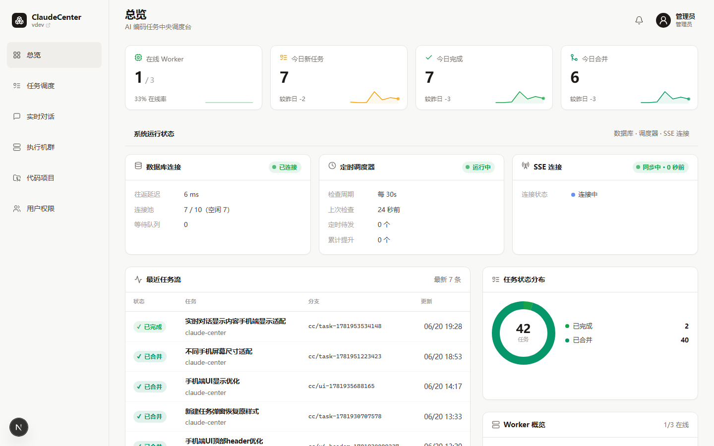

**任务调度** — 多维筛选的任务列表与侧栏统计：

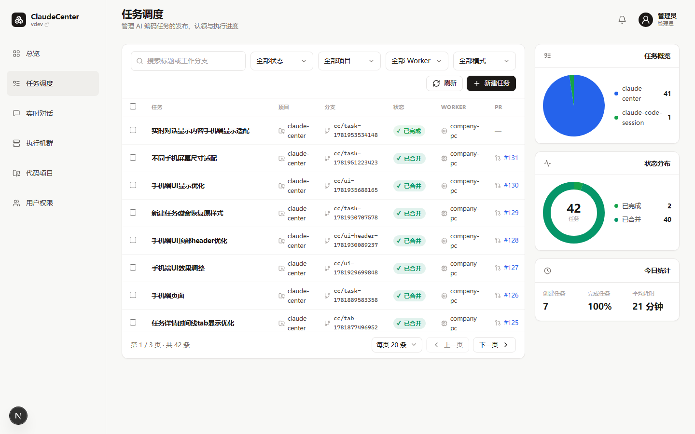

**任务详情** — 执行进度、时间线、Claude Code 执行会话富展示（工具调用 / diff / thinking）：

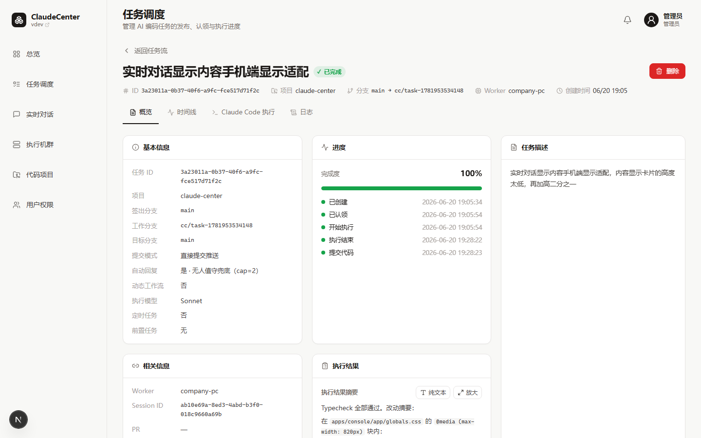

**执行机群** — 多台 Worker 的在线状态、心跳时间、并发容量与完成数：

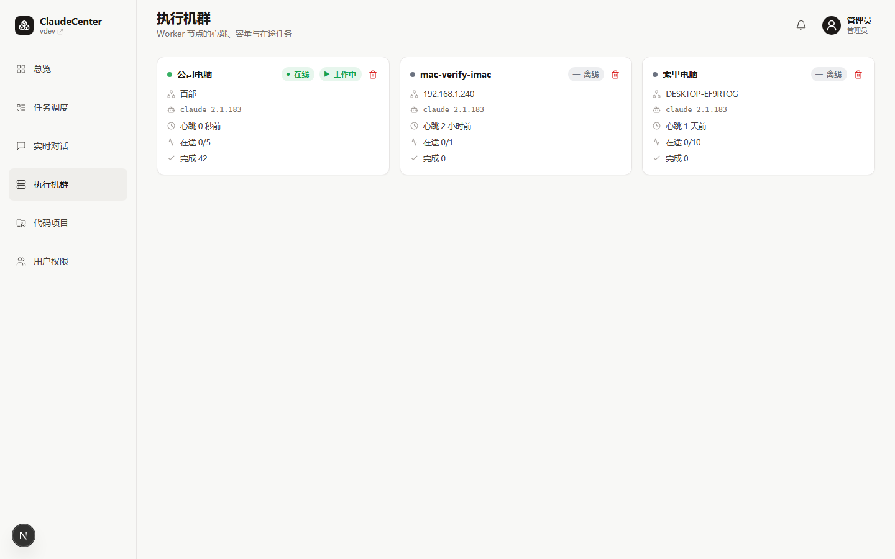

**实时对话** — 不经任务队列，直接指定 Worker 与项目分支的多轮对话：

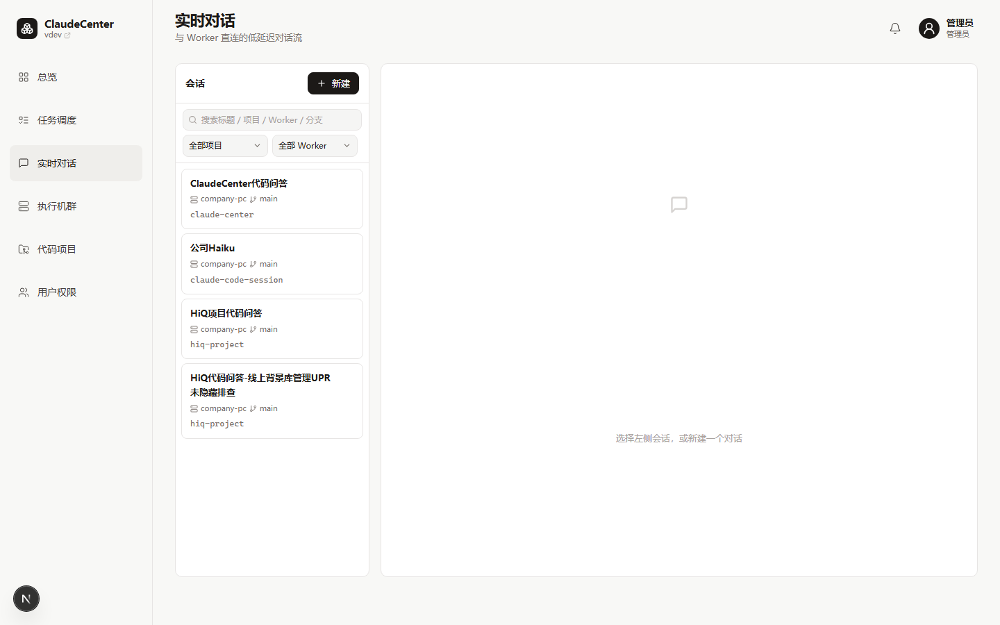

### Web Console（手机端）

任何设备打开浏览器即可使用，移动端自适应布局：

<table><tr>
<td>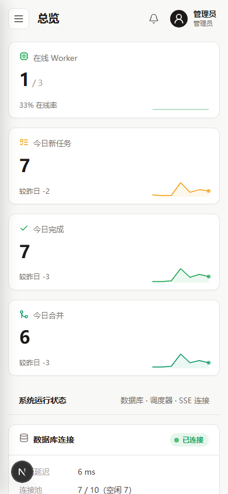</td>
<td>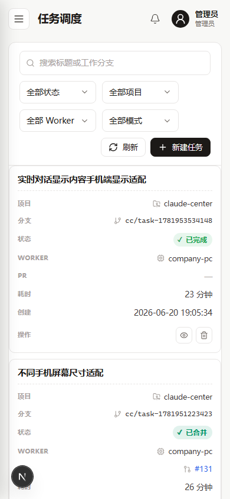</td>
<td>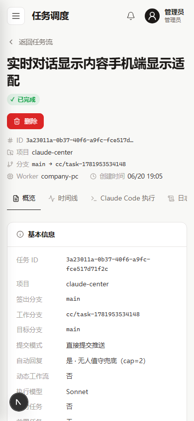</td>
<td>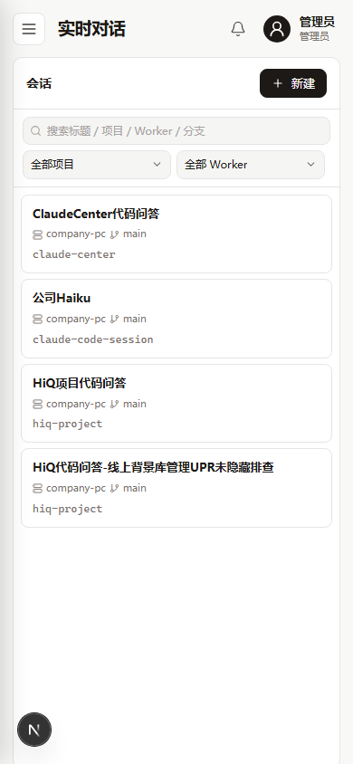</td>
</tr></table>

### Worker 桌面应用

**总览** — 工作状态、在途任务、套餐用量（5h / 7d 窗口）、能力自检（git / gh / claude）：

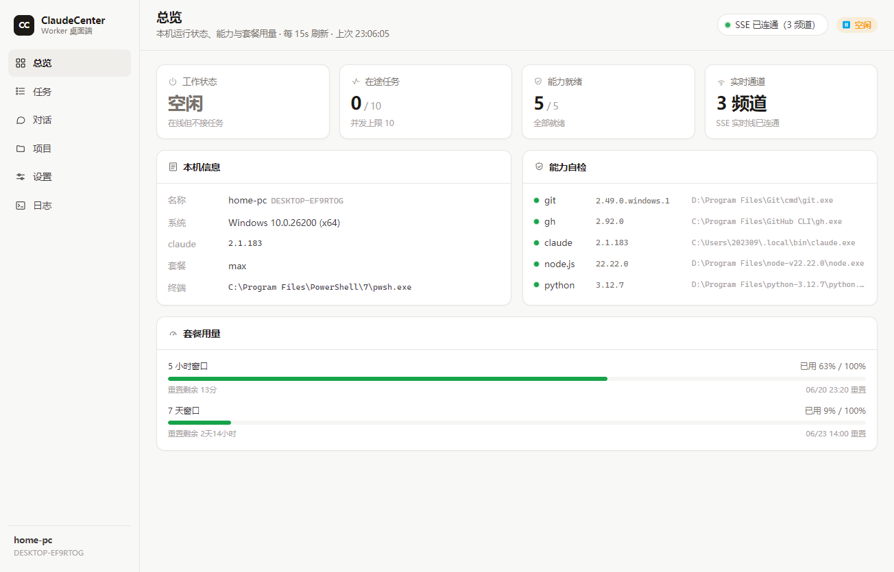

**关联项目** — 可视化管理本机项目与本地路径的绑定，无需手写 JSON：

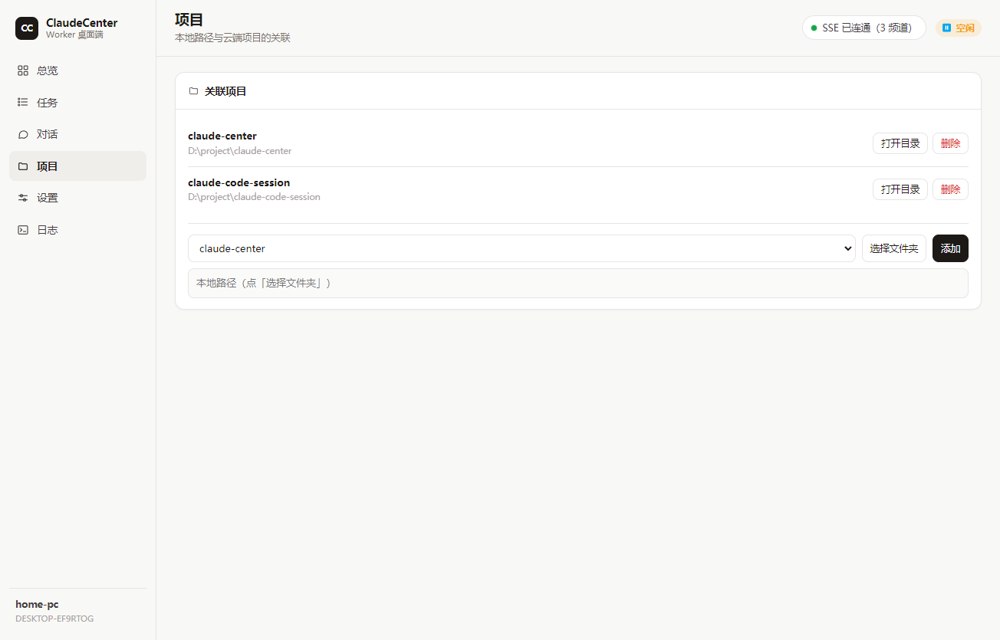

**设置** — 工作状态开关、并发上限、运行终端与前置命令（代理 / VPN）、SSE 中转地址：

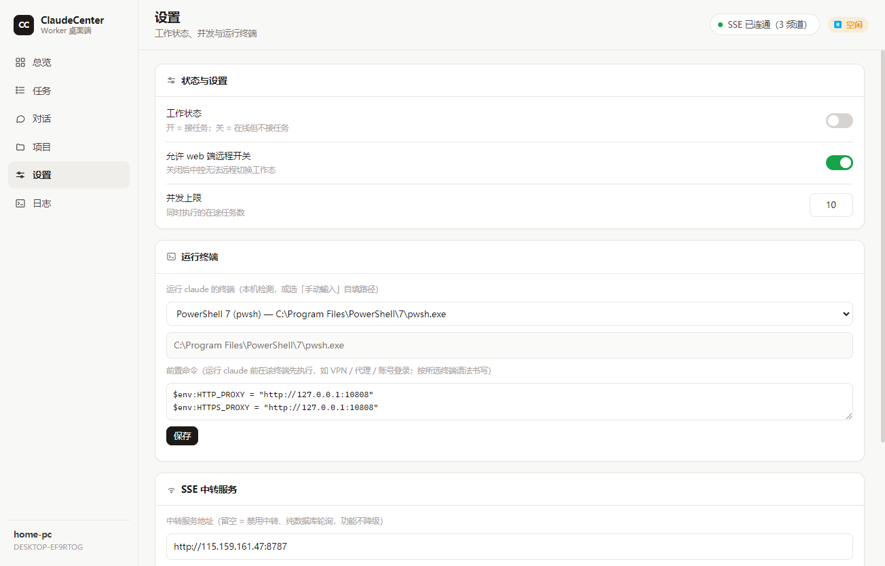

## 快速开始

**前置依赖**：Node.js 20+、PostgreSQL 15+、`git`、`claude` CLI、`gh` CLI。

```powershell
# 1. 安装依赖
npm install

# 2. 配置环境变量
Copy-Item .env.example .env
# 编辑 .env，填入 DATABASE_URL（PostgreSQL 连接串）

# 3. 初始化数据库
npm run db:migrate

# 4. 启动 Web Console（默认 http://127.0.0.1:3000）
npm run dev:console

# 5. 启动 Worker（另开终端）
npm run dev:worker
```

首次访问跳转到 `/login`，用引导管理员登录：用户名 `admin` / 密码 `admin123`（由迁移写入）。**登录后请立即在「用户权限」里重置密码。**

## 架构

```
┌─────────────────────────────────────────────┐
│  Web Console（Next.js · apps/console）       │
│  任务发布 · 进度监控 · 验收 · 用户管理        │
└──────────────────┬──────────────────────────┘
                   │ PostgreSQL（唯一权威）
         ┌─────────┴──────────┐
         │  可选 SSE 中转       │  ← apps/relay（亚秒级实时线）
         └─────────┬──────────┘    不可用时自动退回 DB 轮询
                   │
┌──────────────────▼──────────────────────────┐
│  Desktop Worker（Electron · apps/worker）    │
│  心跳 · 任务认领 · Claude Code 执行 · PR 创建 │
│  可在多台机器同时运行                         │
└─────────────────────────────────────────────┘
```

| 包 | 说明 |
|---|---|
| `apps/console` | Web 中控台：项目管理、任务发布、监控、定向指令 |
| `apps/worker` | 桌面 Worker：任务执行、git worktree 隔离、PR 创建 |
| `apps/relay` | 可选 SSE 中转服务，低延迟实时推送 |
| `packages/db` | PostgreSQL schema、迁移脚本、共享查询函数 |
| `packages/relay-client` | 中转服务共享客户端（事件契约 / 发布订阅 / 票据） |

## 功能一览

### 任务生命周期

任务从草稿发布进入可认领队列，Worker 领取后在独立 git worktree 中执行 Claude Code，结果推送为 PR 或直接合并，支持全程无人值守。

```
draft / scheduled ──发布/到点──▶ pending ──▶ claimed ──▶ running
                                                              │
                                              ┌───────────────┤
                                         waiting（等回复）    │
                                              └───────────────┤
                                                              ▼
                                          success ──验收──▶ accepted
                                          failed             │ 打回
                                          cancelled   rejected ──▶ 重跑
                                          merged（PR 已合并）
```

### 核心能力

**任务调度**
- 草稿门禁：新建任务为草稿，发布后才进入队列，给发布前复核的机会
- 定时发布：设置未来时间，Console 调度器到点自动推入队列
- 前置依赖：任务 A 完成前，任务 B 不会被认领
- 取消在途：随时中断正在运行的 Claude 进程，不丢已有改动

**并发执行**
- 每台 Worker 可配置并发上限（`CLAUDE_CENTER_MAX_PARALLEL`）
- 每个任务在独立 git worktree 中运行，同项目多任务互不干扰
- 任务执行全程同步 Claude Code session transcript 到数据库，详情页实时回放

**无人值守**
- `bypassPermissions` 模式：headless 执行不为权限询问停顿
- 自动回复：Claude 中途遇到歧义自主决策，哨兵出现时按有无改动自动分流（提交/失败），上限 2 轮
- 决策预案：创建任务时可填偏好描述，喂入 prompt 引导 Claude 自主决策

**验收闭环**
- 人工验收：PR 完成后可一键通过或带意见打回
- 打回重跑：Worker 续接同一 Claude 会话修订，复用原 PR
- 自动验收：Console 后台定时检测 PR 合并状态，Worker 离线时也能自动收口

**实时对话**
- 独立于任务队列，直接指定 Worker + 项目分支多轮对话
- 助手回复以 Claude Code 完整执行会话富展示（工具折叠 / diff 着色 / thinking）
- Worker 空闲态也响应，不占任务并发槽

**远程控制**
- Web Console 可向指定 Worker 下发任意终端命令，结果实时回传
- 远程切换 Worker 工作状态（空闲 ↔ 工作），需 Worker 开启「允许远程控制」

### Worker 桌面端

Worker 桌面窗口除执行任务外，还提供本机视角的任务面板：
- 按状态分组查看本机全部任务（需输入 / 待审 / 进行中 / 已完成）
- 就地回复等待中的 Claude 提问、验收或打回已完成任务、取消在途任务
- 可视化管理关联项目（项目 + 本地路径），无需手写 JSON
- 实时查看套餐用量（5h / 7d 窗口已用率 + 重置倒计时）

### SSE 中转（可选实时线）

在 DB 轮询基础上叠加独立 SSE 中转服务，Console↔Worker 通信延迟从秒级降到亚秒级。

- 默认禁用：`CLAUDE_CENTER_RELAY_URL` 为空时纯走 DB 轮询，与启用前行为一致
- 消息先落库再发布，中转只搬运事件，DB 始终是唯一权威与持久备份
- 断线自动重连（指数退避 + 抖动），`Last-Event-ID` 短重放防丢事件
- 连通状态在 Console 顶栏与 Worker 桌面端实时可见

```powershell
npm run dev:relay                         # 启动中转服务（默认 127.0.0.1:8787）
node apps/relay/dist/main.js --check      # 零副作用自检
npm -w @claude-center/relay run selftest  # 完整自验证
```

## 权限与多用户

Console 需要登录，支持四个角色：

| 角色 | 能力 |
|---|---|
| `viewer` | 查看分配给自己的项目与任务 |
| `commenter` | 上 + 在任务对话里回复 Claude 提问 |
| `publisher` | 上 + 创建 / 发布任务 |
| `admin` | 全部权限：定向指挥、建项目、用户管理，且看全部项目 |

非 admin 用户只能看到管理员分配给自己的项目；密码散列与会话 token 全部由 PostgreSQL pgcrypto 完成，无额外依赖。

## Worker 配置

**前置依赖**：Worker 机器需要命令行可访问 `git`、`claude`（可用 `CLAUDE_CODE_COMMAND` 覆盖）、`gh`（可用 `GH_COMMAND` 覆盖）。启动时自检三个命令并将版本上报 Console。

**关联项目**：可在桌面窗口可视化添加，也可用环境变量：

```json
CLAUDE_CENTER_PROJECTS=[{"projectName":"Example","repoUrl":"https://github.com/acme/example.git","localPath":"D:\\src\\example"}]
```

**代理 / 前置命令**：在 Worker 窗口「运行终端」卡片配置终端类型与前置命令（如设置代理、登录），前置命令与 `claude` 在同一终端会话里顺序执行，所设环境变量自动被 `claude` 继承。

**关键环境变量**：

| 变量 | 说明 |
|---|---|
| `CLAUDE_CENTER_MAX_PARALLEL` | 单 Worker 并发任务上限（默认 1） |
| `CLAUDE_CENTER_ALLOW_REMOTE_CONTROL` | 是否允许 Web 端远程切换工作状态 |
| `CLAUDE_CENTER_USAGE_PROXY` | 套餐用量采集代理（国内必填，与前置命令代理两套出口） |
| `CLAUDE_CENTER_TERMINAL` | 运行终端可执行文件路径 |
| `CLAUDE_CENTER_CLAUDE_PRE_COMMAND` | 执行 `claude` 前的前置命令 |

## 本地验证

```powershell
npm run typecheck    # db / relay-client / console / worker / relay 五包
npm run build
npm run db:migrate
npm run verify:console   # 启动 Console，断言 401→登录→200，自动关闭
npm -w @claude-center/relay run selftest  # relay 自验证（可选）
```

## 部署与发版

两条独立 tag 路径：

| Tag | 触发 | 产物 |
|---|---|---|
| `cc-vX.Y.Z` | `.github/workflows/deploy-web.yml` | Console + Relay 部署到生产服务器（Docker Compose） + GitHub Release |
| `worker-vX.Y.Z` | `.github/workflows/release-worker.yml` | Windows / macOS 安装包上传到 GitHub Release Assets |

### Web 端发版

```powershell
# 1. 在 CHANGELOG-console.md 写好 [X.Y.Z] 节并 commit/push
# 2. 自检 + 打 tag
node scripts/deploy-web-trigger.mjs 0.2.0 --check  # 只自检
node scripts/deploy-web-trigger.mjs 0.2.0           # 自检通过后打 tag 推送触发 CI
gh run watch
```

### 桌面端发版

```powershell
# 1. 在 CHANGELOG-worker.md 写好 [X.Y.Z] 节并 commit/push
# 2. 自检 + 打 tag
node scripts/release-worker-trigger.mjs 0.2.0 --check
node scripts/release-worker-trigger.mjs 0.2.0
gh run watch  # Windows + macOS 并行打包，约 10–15 分钟
```

> Windows 首次启动会弹 SmartScreen，点「更多信息 → 仍要运行」；macOS 首次需右键打开或 `xattr -d com.apple.quarantine`。

### 服务器首次 Bootstrap（国内环境）

国内服务器 `github.com:443` 普遍不通，bootstrap 走本地打包 + scp 上传：

```powershell
tar czf /tmp/cc-bootstrap.tar.gz `
  --exclude=node_modules --exclude=.next --exclude=dist --exclude=.git `
  --exclude=apps/worker/release --exclude=.env -C D:\project\claude-center .
scp /tmp/cc-bootstrap.tar.gz ubuntu@<host>:/tmp/
```

```bash
# 服务器端
sudo BUNDLE=/tmp/cc-bootstrap.tar.gz bash /tmp/cc-bootstrap-extract/scripts/server-bootstrap.sh
vim /opt/claude-center/.env  # 填 DATABASE_URL
```

后续 CI 每次 `cc-vX.Y.Z` tag 自动覆盖式部署，无需重复 bootstrap。

宿主机需预装：docker engine + docker compose v2（推荐阿里云镜像源）、Docker registry mirror、PostgreSQL 监听 `:55432`。

### GitHub Secrets

| Secret | 说明 |
|---|---|
| `DEPLOY_SSH_KEY` | SSH 私钥 |
| `DEPLOY_HOST` | 服务器 IP / 域名 |
| `DEPLOY_PORT` | SSH 端口（默认 22） |
| `DEPLOY_USER` | SSH 用户（默认 ubuntu） |
| `DEPLOY_KNOWN_HOSTS` | `ssh-keyscan -p 22 <host>` 输出 |

### 回滚

```bash
ssh ubuntu@<host>
sudo -i && cd /opt/claude-center
git tag -l 'cc-v*' --sort=-v:refname | head -5
APP_VERSION=0.1.9 bash scripts/deploy-on-server.sh 0.1.9
```
